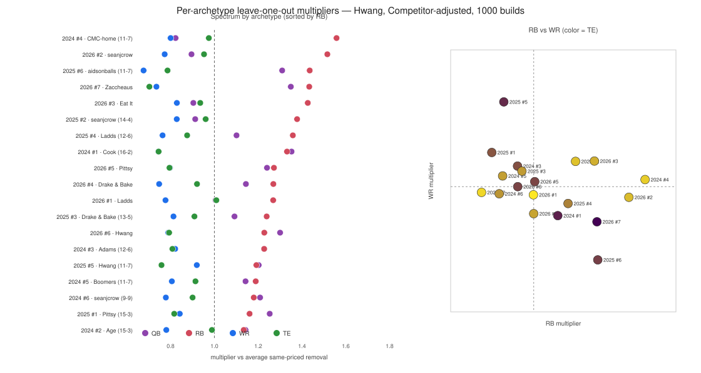

# Same-priced removal, by Hwang archetype

What you lose from taking one QB, RB, WR, or TE off the 26 at the
**same competitor-adjusted (redraft) KTC price**, on each of the 19
competitive templates.

This is the chart that sits behind the Hwang **format factor** — but
the chart itself is **not** the format factor. The spectrum is Hwang-only
(each position vs the average same-priced *removal*). The format factor
is Hwang ÷ Regular, measured on this same leave-one-out experiment.

Data: `example_data/hwang_true_sim_removal/`
Reproduce:

```bash
npx tsx scripts/run_hwang_true_sim_removal.mjs 1 1000 example_data/hwang_true_sim_removal
python scripts/analyze_hwang_true_sim_removal.py example_data/hwang_true_sim_removal
python scripts/fit_hwang_format_factor_coeffs.py \
  --hwang-dir example_data/hwang_true_sim_removal \
  --ud-dir example_data/hwang_true_sim_removal \
  --ud-format regular
```

**1,000 builds** per archetype-year, 10% jitter, 2021–2025. Each build is
a full 26-man. HVORP is leave-one-out of a player already on that roster.
Pairs are two rostered players at different positions whose prices sit
within ±5%. Density comes from more jittered rosters, not from a board
pool of extra names to plug in.

Hwang scoring: 1QB / 3RB / 3WR / 1TE / 2FLEX / 1SF, 0 PPR, TE +0.5.
Regular scoring (format-factor denominator): 1QB / 2RB / 3WR / 1TE /
1FLEX / 1SF, 0.5 PPR, TE +0.5. Same 19 templates, same builds.

Multipliers are mean-grounded: the geometric mean of QB/RB/WR/TE is 1.0,
so **1.0 = the average same-priced removal**.

Related: [stack vs destack, by archetype](hwang_stack_by_archetype.md).

The previous add-on version of this chart (200 builds, 27th-man plug) is
`example_data/hwang_true_sim_200_v3b/`.

---

## The picture



Left: one row per template, four dots (QB / RB / WR / TE), sorted by RB.
Dashed line is 1.0. Right: RB vs WR, color = TE.

---

## Two different numbers

| | Removal Hwang-only (this chart) | Format factor (Hwang ÷ Regular, same removal dump) | Add-on format factor (v3b) |
|---|---:|---:|---:|
| RB | **1.28×** | **1.22×** | 1.22× |
| QB | 1.13× | 1.07× | 0.99× |
| TE | 0.88× | 0.90× | 0.96× |
| WR | **0.79×** | **0.85×** | 0.86× |

**Hwang-only** answers: of two same-priced players already on a Hwang
26, whose absence hurts more? Losing an RB costs 28% more than the
average same-priced hole; losing a WR costs 21% less.

**Format factor** answers: how much of that is the *rules* (3RB / 2FLEX /
0 PPR vs 2RB / 1FLEX / 0.5 PPR)? Divide the Hwang multiplier by the
Regular multiplier from the same leave-one-out pairs. RB 1.22×, WR 0.85×.

Switching the experiment from add-on to removal **moves the spectrum**
(QB flips from 0.94 to 1.13; RB 1.37 → 1.28; WR 0.87 → 0.79) and
**barely moves the format factor** (RB 1.22 both; WR 0.86 → 0.85). The
rules effect is the same; who you are scoring (27th man vs a player you
already kept) is not.

Live rankings (`hwangPositionCoefficients.js`) stay on the **add-on**
Hwang ÷ Underdog-BBM fit, with QB pinned at 1.0. That file now records
`HWANG_FORMAT_FACTOR_HVORP_MODE = 'addon'` so the two experiments cannot
be mixed. The fitter refuses a numerator and denominator from different
HVORP modes.

---

## The sign never flips

**All 19 templates have RB above 1.0** (lowest 1.13, Age is just a
number). **All 19 have WR below 1.0** (highest 0.92, House of Hwang
2025).

Construction changes the *size* of the premium, not the direction.
Fattest RB bars are rooms whose same-priced RBs were already weekly
starters — CMC-home (1.56) and seanjcrow 2026 (1.52). Let James Cook
jumps from last on add-on (1.23) to eighth here (1.33): losing an early
RB you were going to start three of hurts more than adding a fourth.

---

## Per template

Sorted by RB multiplier, high first. Template names are the source Hwang
team; the multiplier is from instantiating that **rank template** onto
2021–2025 boards, not from scoring those original players.

| Template | QB | RB | WR | TE | RB − WR |
|---|---:|---:|---:|---:|---:|
| 2024 #4 We Have McCaffrey at Home (11-7) | 0.82 | **1.56** | 0.80 | 0.97 | 0.76 |
| 2026 #2 seanjcrow | 0.90 | **1.52** | 0.77 | 0.95 | 0.74 |
| 2025 #6 aidsonballs (11-7) | 1.31 | 1.44 | **0.68** | 0.79 | 0.76 |
| 2026 #7 MrZaccheaus | **1.35** | 1.43 | 0.74 | 0.70 | 0.70 |
| 2026 #3 Eat It While She Sleeper | 0.90 | 1.43 | 0.83 | 0.94 | 0.60 |
| 2025 #2 seanjcrow (14-4) | 0.91 | 1.38 | 0.83 | 0.96 | 0.55 |
| 2025 #4 The Ladds (12-6) | 1.10 | 1.36 | 0.76 | 0.88 | 0.59 |
| 2024 #1 Let James Cook (16-2) | **1.35** | 1.33 | 0.74 | 0.75 | 0.59 |
| 2026 #5 Lord Pittsy Flacco Joedy | 1.24 | 1.27 | 0.80 | 0.80 | 0.48 |
| 2026 #4 Drake & Bake | 1.14 | 1.27 | 0.75 | 0.92 | 0.52 |
| 2026 #1 The Ladds | 1.01 | 1.27 | 0.78 | 1.01 | 0.49 |
| 2025 #3 Drake & Bake (13-5) | 1.09 | 1.24 | 0.81 | 0.91 | 0.43 |
| 2026 #6 House of Hwang | 1.30 | 1.23 | 0.79 | 0.79 | 0.44 |
| 2024 #3 Adam(s) and Steve(nson) (12-6) | 1.23 | 1.23 | 0.82 | 0.81 | 0.41 |
| 2025 #5 House of Hwang (11-7) | 1.20 | 1.19 | **0.92** | 0.76 | 0.27 |
| 2024 #5 The Boomers (11-7) | 1.14 | 1.19 | 0.81 | 0.91 | 0.38 |
| 2024 #6 seanjcrow (9-9) | 1.21 | 1.18 | 0.78 | 0.90 | 0.40 |
| 2025 #1 Lord Pittsy Flacco Joedy (15-3) | 1.25 | 1.16 | 0.84 | 0.82 | 0.32 |
| 2024 #2 Age is just a number (15-3) | 1.14 | 1.13 | 0.78 | 0.99 | 0.35 |

QB below 1.0 only on rooms that already roster two live QBs (CMC-home,
both seanjcrow 2026/2025, Eat It). Thin-QB rooms (Zaccheaus, Cook) print
QB ~1.35: the QB you kept was not spare. That is roster context. It is
not the format factor — format-factor QB is ~1.07 here and stays pinned
at 1.0 in live rankings (no 1QB Underdog denominator).

Tightest RB−WR gap is Hwang 2025 (0.27). Widest is CMC-home /
aidsonballs (~0.76).

603k same-roster comparable-price pairs on the competitor-adjusted Hwang
board.

---

## How to read this vs add-on vs stacks

| | Add-on | Removal (this) |
|---|---|---|
| Builds per template-year | 200 | **1,000** |
| Who is scored | Top-300 board names at equal price, plugged as the 27th man | Players **already on** the jittered 26 |
| Pairing | Large cross-position board pool within ±5% KTC | Same-roster players within ±5% KTC |
| Hwang-only question | “What do I get from another player at this price?” | “What do I lose if I drop a player I already have at this price?” |
| Format factor | Hwang ÷ Regular from **add-on** HVORP | Hwang ÷ Regular from **removal** HVORP |

Use add-on for “who to acquire.” Use removal for “who is holding this
roster up.” Use the format factor (either experiment — RB/WR agree) for
“how much of that is the Hwang rules.”

The stack study is a third question: swap existing slots onto the same
NFL team, talent held fixed.

---

## Reproduce

```bash
npx tsx scripts/run_hwang_true_sim_removal.mjs 1 1000 example_data/hwang_true_sim_removal
python scripts/analyze_hwang_true_sim_removal.py example_data/hwang_true_sim_removal
```

Canvas version (same numbers): open
`archetype-positional-spectrum.canvas.tsx` beside chat.
