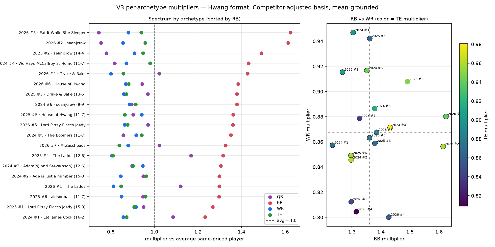

# Same-priced add-on, by Hwang archetype

What you get from adding one more QB, RB, WR, or TE at the **same
competitor-adjusted (redraft) KTC price**, on each of the 19 competitive
templates. This is the chart that sits behind the Hwang format factor.

Data: `example_data/hwang_true_sim_200_v3b/`
Reproduce: `scripts/analyze_hwang_true_sim_v3.py example_data/hwang_true_sim_200_v3b`

200 builds per archetype-year, 10% jitter, 2021–2025. Hwang scoring:
1QB / 3RB / 3WR / 1TE / 2FLEX / 1SF, 0 PPR, TE +0.5. Add-on = 27th player
at that price (leave-one-out if they were already on the 26). Multipliers
are mean-grounded: the geometric mean of QB/RB/WR/TE is 1.0, so **1.0 =
the average same-priced add**.

Related: [stack vs destack, by archetype](hwang_stack_by_archetype.md).

---

## The picture



Left: one row per template, four dots (QB / RB / WR / TE), sorted by RB.
Dashed line is 1.0. Right: RB vs WR, color = TE.

---

## Pooled (all 19 templates)

| Position | Multiplier vs average same-priced add |
|---|---:|
| RB | **1.37×** |
| QB | 0.94× |
| TE | 0.90× |
| WR | **0.87×** |

An extra same-priced RB returns 37% more season points than the average
same-priced add. An extra same-priced WR returns 13% less. That gap is
the Hwang format factor (RB ~1.20 vs regular, WR ~0.86 vs regular) in
Hwang-only units.

---

## The sign never flips

**All 19 templates have RB above 1.0** (lowest 1.23, Let James Cook).
**All 19 have WR below 1.0** (highest 0.95, Adam(s) and Steve(nson)).

Construction changes the *size* of the premium, not the direction.
WR-light rooms (Eat It, seanjcrow) have the fattest RB bars. The most
RB-heavy room in the league still wants another same-priced RB more than
the average add.

---

## Per template

Sorted by RB multiplier, high first. Template names are the source Hwang
team; the multiplier is from instantiating that **rank template** onto
2021–2025 boards, not from scoring those original players.

| Template | QB | RB | WR | TE | RB − WR |
|---|---:|---:|---:|---:|---:|
| 2026 #3 Eat It While She Sleeper | 0.74 | **1.62** | 0.88 | 0.94 | 0.74 |
| 2026 #2 seanjcrow | 0.76 | **1.61** | 0.86 | 0.96 | 0.76 |
| 2025 #2 seanjcrow (14-4) | 0.78 | 1.49 | 0.91 | 0.95 | 0.58 |
| 2024 #4 We Have McCaffrey at Home (11-7) | 0.82 | 1.43 | 0.87 | 0.98 | 0.56 |
| 2026 #4 Drake & Bake | 1.02 | 1.43 | 0.80 | 0.86 | 0.63 |
| 2026 #6 House of Hwang | 0.94 | 1.39 | 0.87 | 0.88 | 0.52 |
| 2025 #3 Drake & Bake (13-5) | 0.97 | 1.38 | 0.86 | 0.87 | 0.52 |
| 2024 #6 seanjcrow (9-9) | 0.90 | 1.38 | 0.89 | 0.91 | 0.49 |
| 2025 #5 House of Hwang (11-7) | 0.90 | 1.36 | 0.94 | 0.86 | 0.42 |
| 2026 #5 Lord Pittsy Flacco Joedy | 0.97 | 1.36 | 0.86 | 0.88 | 0.50 |
| 2024 #5 The Boomers (11-7) | 0.86 | 1.35 | 0.92 | 0.94 | 0.44 |
| 2026 #7 MrZaccheaus | 1.02 | 1.33 | 0.88 | 0.84 | 0.45 |
| 2025 #4 The Ladds (12-6) | **1.17** | 1.32 | 0.80 | 0.81 | 0.51 |
| 2024 #3 Adam(s) and Steve(nson) (12-6) | 0.90 | 1.30 | **0.95** | 0.90 | 0.36 |
| 2024 #2 Age is just a number (15-3) | 0.95 | 1.30 | 0.85 | 0.96 | 0.45 |
| 2026 #1 The Ladds | 1.12 | 1.30 | 0.81 | 0.85 | 0.49 |
| 2025 #6 aidsonballs (11-7) | 0.95 | 1.30 | 0.85 | 0.96 | 0.45 |
| 2025 #1 Lord Pittsy Flacco Joedy (15-3) | 0.95 | 1.27 | 0.92 | 0.91 | 0.35 |
| 2024 #1 Let James Cook (16-2) | 1.09 | 1.23 | 0.86 | 0.87 | 0.38 |

QB is the noisy one. Weak-QB rooms (Eat It, seanjcrow) print QB ~0.74–0.78
because an extra same-priced QB is the third starter on a club that
already has two live ones. Thin-QB rooms (The Ladds, Let James Cook)
print QB above 1.0. That is roster context, not a format flip.

---

## How to read this vs the stack study

This chart is **add a 27th player at equal price**. The stack study is
**swap existing slots onto the same NFL team**, talent held fixed.

They answer different questions. This one says: at any of these
constructions, another same-priced RB is the best add and another
same-priced WR is the worst. The stack study says: correlating two
slots you already own is a wash unless the template’s scarce ranks
match the stack.

---

## Reproduce

```bash
# dump already at example_data/hwang_true_sim_200_v3b/
python scripts/analyze_hwang_true_sim_v3.py example_data/hwang_true_sim_200_v3b
```

Canvas version (same numbers): open
`archetype-positional-spectrum.canvas.tsx` beside chat.
