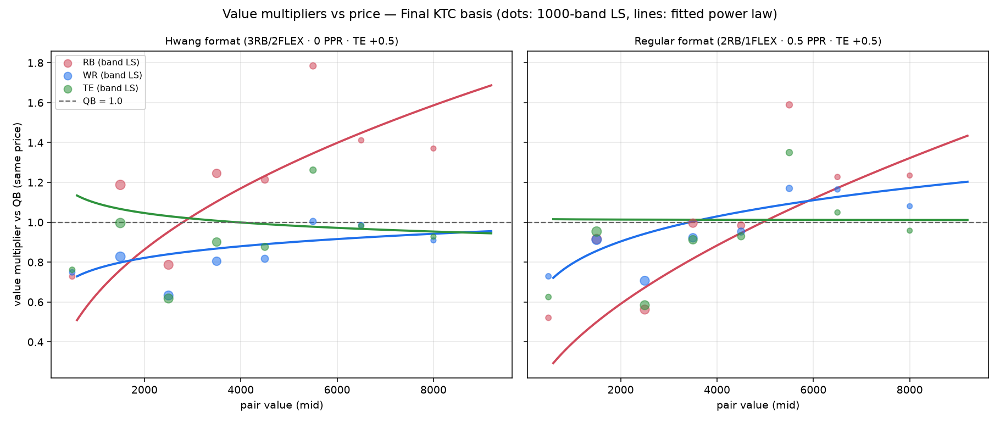
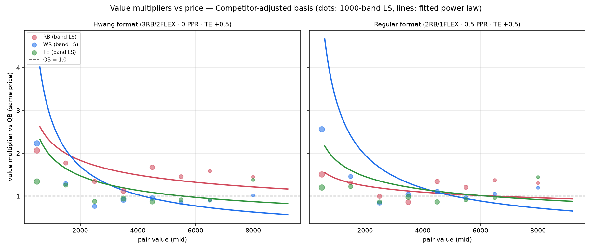
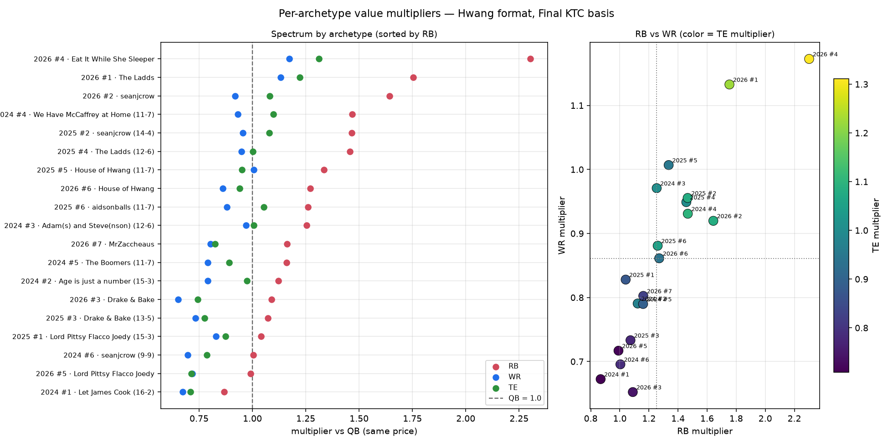
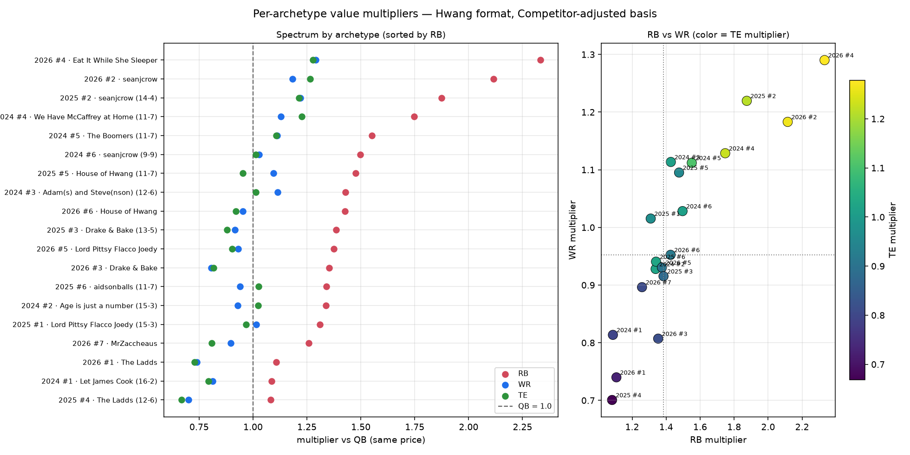

# Hwang True Simulator — 200-Build Diagnostics Report (v1)

> **⚠️ SUPERSEDED:** This version was run with an incorrect archetype set — the 2025 top-7
> mistakenly included a tanker (PUPpy Bowl, 5-13). See the v2 report for corrected data.
> Preserved because the methodology and most conclusions carry over.

## What got built and run

**Engine + UI:** The simulator now supports a **value basis** setting — Final KTC or Competitor
Adjusted. It drives all three things: archetype slot ranks (from `comp_adj_pos_rank` in the
archetype CSV), the historical season boards (competitor-adjusted values joined to sleeper IDs —
the name join is exact, 0 misses), and the value-matched pairing. There's a
"Value basis (builds + pairing)" dropdown in the web UI, so you can run your own comp-adjusted sims.

**The example run:** 200 builds × 20 archetypes × 5 seasons, seed 1, jitter 10%, across the full
grid — {KTC, comp} × {Hwang, Regular (1QB/2RB/3WR/1TE/1FLEX/1SF · 0.5 PPR · 0.5 TEP)}. All 254k
rows saved to `example_data/hwang_true_sim_200/`, with `value_basis` and `format` columns on every
CSV. The analysis is reproducible via `scripts/analyze_hwang_true_sim_example.py`.

One validation up front: **comp-based builds average ~7% more real season points than KTC-based
builds** (2,622 vs 2,453 per 26-man base). Uniform-KTC construction was indeed building teams too
weak.

---

## Writeup 1: Final KTC basis

**Baseline multipliers** (full comparison network, QB = 1.0):

| | Hwang | Regular | Format factor |
|---|---|---|---|
| RB | **1.267** | 1.077 | 1.18 |
| WR | **0.828** | 0.958 | 0.86 |
| TE | **0.908** | 0.923 | 0.98 |

The 200-build run confirms the earlier 10-build numbers almost exactly — those were already
converged. Story unchanged: per KTC dollar, RBs deliver +27% in Hwang, WRs −17%, TEs −9%. Even the
Regular league has RBs underpriced (+8%) — that's the longevity discount showing up in any
single-season lens; Hwang's format adds another +18% on top of it.

**By 1000-KTC band** (Hwang / Regular / factor):

| Band | Pairs | RB | WR | TE |
|---|---|---|---|---|
| 1k–2k | 1,479 | 1.23 / 1.00 / **1.23** | 0.81 / 0.89 / 0.91 | 0.98 / 0.94 / 1.04 |
| 2k–3k | 1,297 | 0.82 / 0.62 / **1.32** | 0.63 / 0.70 / 0.90 | 0.61 / 0.58 / 1.06 |
| 3k–4k | 1,096 | 1.28 / 1.07 / **1.20** | 0.80 / 0.91 / 0.87 | 0.89 / 0.90 / 0.99 |
| 4k–5k | 658 | 1.23 / 1.04 / **1.19** | 0.80 / 0.94 / 0.86 | 0.86 / 0.92 / 0.94 |
| 5k–6k | 427 | 1.81 / 1.65 / 1.09 | 0.99 / 1.15 / 0.86 | 1.25 / 1.33 / 0.93 |
| 6k–7k | 181 | 1.44 / 1.29 / 1.12 | 0.98 / 1.16 / 0.85 | 0.98 / 1.05 / 0.93 |
| 7k+ | 131 | 1.40 / 1.29 / 1.09 | 0.91 / 1.08 / 0.84 | 0.93 / 0.96 / 0.97 |

Same pattern as before, now with tighter data: the RB **format** factor is biggest at the cheap end
(~1.3 → ~1.1 as you go elite), the WR tax is remarkably flat (~0.85–0.91 everywhere), TE format
effect is basically neutral.

**Fitted equation.** Fit as a continuous model directly on the 5,474 pair-level log-ratios
(QB pinned at 1.0); a power law fits the shape well:

    m_pos(v) = c · (v/5000)^k

| Position | Hwang equation | @1k | @3k | @5k | @8k |
|---|---|---|---|---|---|
| RB | 1.333 · (v/5000)^+0.350 | 0.76× | 1.11× | 1.33× | 1.57× |
| WR | 0.888 · (v/5000)^+0.117 | 0.74× | 0.84× | 0.89× | 0.94× |
| TE | 0.970 · (v/5000)^−0.055 | 1.06× | 1.00× | 0.97× | 0.95× |

The shape reads cleanly: **RB value vs KTC price grows with player quality** (elite RBs are the
most underpriced assets on the board, ~1.5×), WR climbs gently but never reaches fair, TE is
essentially flat at ~0.95–1.0. Honest caveat: pair-level R² is only 0.014 — individual pairs are
dominated by breakout/bust variance, so the equation describes the *systematic* pricing skew, not a
predictor of any single pair. The curves track the band-level dots well, which is the level the
model is meant for.

---

## Writeup 2: Competitor-adjusted basis

**Baseline multipliers:**

| | Hwang | Regular | Format factor |
|---|---|---|---|
| RB | **1.474** | 1.228 | 1.20 |
| WR | **0.962** | 1.096 | 0.88 |
| TE | **0.951** | 0.965 | 0.99 |

Two headline findings:

1. **The format factors are nearly identical to the KTC basis** (RB 1.20 vs 1.18, WR 0.88 vs 0.86,
   TE 0.99 vs 0.98). The format effect is a stable property of Hwang scoring — it doesn't care what
   pricing lens you use. Great robustness check.
2. **Comp-adjusted pricing fixes most of the WR/TE mispricing but makes RB look even more
   underpriced.** WR goes from 0.83 → 0.96 (nearly fair) and TE 0.91 → 0.95, because the comp index
   already strips out the future-value premium baked into dynasty WR/TE prices. But RB jumps
   1.27 → **1.47**: even valued purely as this-season assets, RBs deliver ~47% more HVORP per comp
   dollar than QBs. The redraft index inherits market ADP, and market ADP assumes PPR-ish scoring
   and 1QB-leaning demand — it still underrates what an RB does in a 0-PPR, 3RB+2FLEX best-ball
   lineup.

**By 1000-comp-value band:**

| Band | Pairs | RB | WR | TE |
|---|---|---|---|---|
| 0k–1k | 887 | 2.19 / 1.73 / **1.27** | 2.21 / 2.51 / 0.88 | 1.33 / 1.19 / 1.12 |
| 1k–2k | 383 | 1.86 / 1.47 / **1.27** | 1.28 / 1.44 / 0.89 | 1.25 / 1.21 / 1.03 |
| 2k–3k | 431 | 1.39 / 1.10 / **1.27** | 0.75 / 0.83 / 0.91 | 0.87 / 0.86 / 1.02 |
| 3k–4k | 721 | 1.16 / 0.93 / **1.24** | 0.90 / 1.02 / 0.89 | 0.93 / 0.97 / 0.96 |
| 4k–5k | 559 | 1.71 / 1.43 / 1.20 | 0.95 / 1.09 / 0.87 | 0.86 / 0.86 / 1.00 |
| 5k–6k | 395 | 1.48 / 1.27 / 1.17 | 0.84 / 0.95 / 0.88 | 0.91 / 0.91 / 0.99 |
| 6k–7k | 173 | 1.61 / 1.43 / 1.13 | 0.89 / 1.04 / 0.86 | 0.91 / 0.96 / 0.95 |
| 7k+ | 74 | 1.48 / 1.37 / 1.08 | 1.01 / 1.19 / 0.85 | 1.38 / 1.44 / 0.96 |

**Fitted equations** (3,489 pairs, R² = 0.082):

| Position | Hwang equation | @1k | @3k | @5k | @8k |
|---|---|---|---|---|---|
| RB | 1.436 · (v/5000)^−0.383 | 2.66× | 1.75× | 1.44× | 1.20× |
| WR | 0.870 · (v/5000)^−0.718 | 2.76× | 1.26× | 0.87× | 0.62× |
| TE | 1.032 · (v/5000)^−0.381 | 1.91× | 1.25× | 1.03× | 0.86× |

**The shape completely flips** — every exponent goes negative. Under KTC pricing, value-per-dollar
rises with quality; under comp pricing, it falls. The driver is the cheap end: a QB with near-zero
comp value really is worthless in this format (a backup who never starts scores you nothing), while
a $800-comp RB/WR lottery ticket still throws spike weeks that best ball harvests. So *relative to
comp-equal QBs*, cheap skill players massively out-deliver. At the elite end, comp-priced WRs
actually flip to underdelivering (0.62× at 8k) — consistent with market ADP overpricing elite WRs
for a 0-PPR format specifically.

---

## Archetype spectrum

For each of the 20 archetypes: aggregate its own matchup totals across all 5 seasons and solve its
personal multiplier set (Hwang format). Visualization: the left panel is a **dot-range plot** — one
row per archetype, three dots (RB/WR/TE multiplier), sorted by RB, so the full spectrum for every
position is readable at once without picking an arbitrary pair of axes. The right panel is the
RB×WR plane with TE as color, which shows the *structure* between archetypes.

What the spectrum says:

- **The spread is enormous.** RB multipliers range from 0.87 (2024 #1 Let James Cook) to 2.30
  (2026 #4 Eat It While She Sleeper) on the KTC basis. The league-wide 1.27 is an average over
  wildly different roster contexts — which is itself the strongest argument that roster-specific
  valuation (the eventual "Ideal Roster Construction" work) matters as much as the global
  coefficients.
- **The dots march up the diagonal together.** In the scatter, RB, WR, and TE multipliers are
  strongly correlated per archetype. That's mostly a *QB-room effect*: everything is grounded to
  that archetype's own QBs, so a team with a stacked QB room (adding another QB is near-worthless)
  sees every other position inflated, and vice versa. Eat It While She Sleeper is top-right with
  everything >1; Let James Cook (Allen-era juggernaut with elite RBs already) is bottom-left with
  everything <1 — plugging anyone into that roster adds little.
- **Deviation off the diagonal is the real construction signal.** PUPpy Bowl is the clearest
  outlier: RB 1.85 but WR 0.61 — an RB-starved, WR-deep roster where an RB plug is worth 3× a WR
  plug at equal price. That's the kind of roster-specific coefficient a trade tool would want.

If we iterate on this viz, the natural next step is to *remove* the QB-room effect — e.g.,
normalize each archetype's multipliers by its geometric mean, or plot the multipliers against the
archetype's positional value shares — so the axes become "construction need" rather than "QB room
strength."

---

**Files:** data in `example_data/hwang_true_sim_200/` (`config`, `years`, `matchups`, `candidates`,
`pairs`, `archetype_player_hvorp`, `build_players`), figures in its `analysis/` subfolder, and the
two reusable scripts are `scripts/run_hwang_true_sim_example.mjs` and
`scripts/analyze_hwang_true_sim_example.py`.
