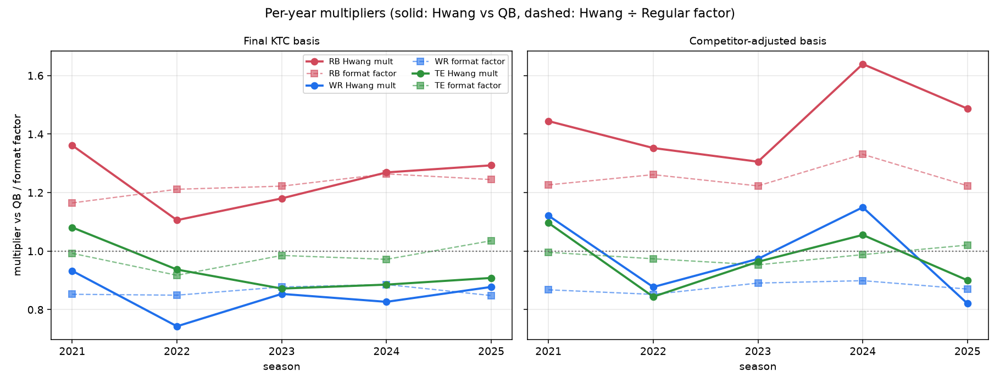

# Hwang True Simulator — 200-Build Diagnostics Report (v2, corrected archetypes)

**Supersedes v1** (`hwang_true_sim_200_report_v1.md`), which mistakenly included a tanker
(2025 PUPpy Bowl, 5-13) as the 2025 #7 archetype.

## The archetype correction

"Top 7 by standings" mechanically pulled PUPpy Bowl into the 2025 set because the 2025 season
had exactly **six** competitive teams (all 11+ wins) and four tankers (PUPpy Bowl 5-13,
The Boomers 4-14, Eat It While She Sleeper 3-15, Sell for Sellers 2-16). There is no legitimate
7th competitor in 2025, so the corrected set excludes all four tankers and 2025 contributes six
archetypes. Final selection (**19 archetypes**):

- **2024** (top 6 by standings): Let James Cook (16-2), Age is just a number (15-3),
  Adam(s) and Steve(nson) (12-6), We Have McCaffrey at Home (11-7), The Boomers (11-7),
  seanjcrow (9-9)
- **2025** (all competitive teams): Lord Pittsy Flacco Joedy (15-3), seanjcrow (14-4),
  Drake & Bake (13-5), The Ladds (12-6), House of Hwang (11-7), aidsonballs (11-7)
- **2026** (sim, by total roster KTC, excluding Sell for Sellers / The Boomers / PUPpy Bowl):
  The Ladds, seanjcrow, Drake & Bake, Eat It While She Sleeper, Lord Pittsy Flacco Joedy,
  House of Hwang, MrZaccheaus

**Impact of the fix:** small on the Hwang-format multipliers, but meaningful for the Regular
format. PUPpy Bowl was an extreme RB-starved roster (its personal RB multiplier was 1.85), so
removing it lowered the league-wide RB multiplier — most visibly in the Regular format
(RB 1.077 → 1.010). As a result the RB **format factor got bigger** (1.18 → 1.22): with clean
archetypes, KTC prices RBs perfectly fairly for a regular league, and the entire Hwang RB premium
is the format itself.

## Run setup

200 builds × 19 archetypes × 5 seasons (2021–2025), seed 1, jitter 10%, full grid:
{Final KTC, competitor-adjusted} × {Hwang (1QB/3RB/3WR/1TE/2FLEX/1SF · 0 PPR · TE +0.5),
Regular (1QB/2RB/3WR/1TE/1FLEX/1SF · 0.5 PPR · TE +0.5)}. Multipliers are QB-grounded
least-squares over the full six-matchup comparison network. Data:
`example_data/hwang_true_sim_200/`; reproduce with `scripts/run_hwang_true_sim_example.mjs`
and `scripts/analyze_hwang_true_sim_example.py`.

Comp-based builds average **~8% more real season points** than KTC-based builds
(2,648 vs 2,456 per 26-man base) — competitor-adjusted construction fixes the
"teams too weak across the board" issue with uniform-KTC construction.

---

## Writeup 1: Final KTC basis

**Baseline multipliers** (QB = 1.0):

| | Hwang | Regular | Format factor |
|---|---|---|---|
| RB | **1.235** | 1.010 | **1.22** |
| WR | **0.839** | 0.973 | 0.86 |
| TE | **0.920** | 0.937 | 0.98 |

This is a cleaner story than v1: in a Regular league, KTC prices every position essentially
fairly (RB 1.01, WR 0.97, TE 0.94) — the longevity discount roughly cancels against
single-season risk. In Hwang, RBs deliver **+24% per KTC dollar** and WRs **−16%**, and that gap
is almost purely the format (0 PPR + 3RB/2FLEX demand).

**By 1000-KTC band** (Hwang / Regular / factor):

| Band | Pairs | RB | WR | TE |
|---|---|---|---|---|
| 0k–1k | 220 | 0.73 / 0.52 / **1.40** | 0.75 / 0.73 / 1.03 | 0.76 / 0.63 / 1.22 |
| 1k–2k | 1,479 | 1.19 / 0.92 / **1.30** | 0.83 / 0.91 / 0.91 | 1.00 / 0.95 / 1.04 |
| 2k–3k | 1,297 | 0.79 / 0.56 / **1.40** | 0.63 / 0.71 / 0.90 | 0.62 / 0.58 / 1.06 |
| 3k–4k | 1,096 | 1.25 / 1.00 / **1.25** | 0.80 / 0.92 / 0.87 | 0.90 / 0.91 / 0.99 |
| 4k–5k | 658 | 1.21 / 0.98 / **1.23** | 0.82 / 0.95 / 0.86 | 0.88 / 0.93 / 0.94 |
| 5k–6k | 427 | 1.78 / 1.59 / 1.12 | 1.00 / 1.17 / 0.86 | 1.26 / 1.35 / 0.93 |
| 6k–7k | 181 | 1.41 / 1.23 / 1.15 | 0.99 / 1.16 / 0.85 | 0.98 / 1.05 / 0.93 |
| 7k+ | 131 | 1.37 / 1.23 / 1.11 | 0.91 / 1.08 / 0.84 | 0.93 / 0.96 / 0.97 |

The RB **format** factor is largest for cheap/mid RBs (~1.3–1.4, the extra RB/FLEX lineup slots
lift depth backs most) and compresses to ~1.1 for elites (who start in any format). The WR tax is
flat (~0.84–0.91 at every price). TE format effect is neutral, mildly positive at the cheap end.

**Fitted power law** — `m(v) = c · (v/5000)^k`, fitted on 5,474 pair-level log-ratios:

| Position | Hwang equation | @1k | @3k | @5k | @8k |
|---|---|---|---|---|---|
| RB | 1.291 · (v/5000)^+0.439 | 0.64× | 1.03× | 1.29× | 1.59× |
| WR | 0.899 · (v/5000)^+0.099 | 0.77× | 0.85× | 0.90× | 0.94× |
| TE | 0.984 · (v/5000)^−0.067 | 1.10× | 1.02× | 0.98× | 0.95× |

Regular-format fits for reference: RB 1.006·(v/5000)^+0.581, WR 1.073·(v/5000)^+0.188,
TE 1.012·(v/5000)^−0.001.

Shape: **RB value per KTC dollar grows with quality** (elite RBs ~1.6× are the most underpriced
assets on the board), WR rises gently but never reaches fair, TE is flat ~0.95–1.0. Caveat:
pair-level R² is 0.013 — individual pairs are dominated by breakout/bust variance; the equation
models the systematic pricing skew (it tracks the band-level dots well, which is its job).

---

## Writeup 2: Competitor-adjusted basis

**Baseline multipliers:**

| | Hwang | Regular | Format factor |
|---|---|---|---|
| RB | **1.432** | 1.143 | **1.25** |
| WR | **0.972** | 1.111 | 0.88 |
| TE | **0.960** | 0.976 | 0.98 |

Headlines:

1. **Format factors match the KTC basis almost exactly** (RB 1.25 vs 1.22, WR 0.88 vs 0.86,
   TE 0.98 vs 0.98). The format effect is a stable property of Hwang scoring, independent of the
   pricing lens. Strong robustness check.
2. **Comp pricing makes WR/TE nearly fair but RB even more underpriced.** WR 0.84 → 0.97 and
   TE 0.92 → 0.96 because the comp index strips the future-value premium out of dynasty WR/TE
   prices. RB jumps 1.24 → **1.43**: even valued purely as this-season assets, RBs deliver ~43%
   more HVORP per comp dollar than QBs. The comp index inherits market ADP, which assumes
   PPR-ish scoring and 1QB demand — it still underrates a 0-PPR, 3RB+2FLEX best-ball RB.

**By 1000-comp-value band:**

| Band | Pairs | RB | WR | TE |
|---|---|---|---|---|
| 0k–1k | 887 | 2.07 / 1.51 / **1.37** | 2.23 / 2.56 / 0.87 | 1.34 / 1.20 / 1.12 |
| 1k–2k | 383 | 1.77 / 1.31 / **1.35** | 1.29 / 1.46 / 0.89 | 1.26 / 1.22 / 1.03 |
| 2k–3k | 431 | 1.34 / 1.00 / **1.35** | 0.76 / 0.84 / 0.91 | 0.88 / 0.86 / 1.02 |
| 3k–4k | 721 | 1.12 / 0.86 / **1.30** | 0.91 / 1.04 / 0.88 | 0.94 / 0.98 / 0.96 |
| 4k–5k | 559 | 1.67 / 1.34 / 1.25 | 0.96 / 1.11 / 0.86 | 0.87 / 0.87 / 1.00 |
| 5k–6k | 395 | 1.45 / 1.21 / 1.21 | 0.85 / 0.96 / 0.88 | 0.91 / 0.92 / 0.99 |
| 6k–7k | 173 | 1.58 / 1.37 / 1.16 | 0.90 / 1.05 / 0.86 | 0.91 / 0.96 / 0.95 |
| 7k+ | 74 | 1.45 / 1.30 / 1.11 | 1.02 / 1.20 / 0.85 | 1.38 / 1.44 / 0.96 |

**Fitted power law** (3,489 pairs, R² = 0.072):

| Position | Hwang equation | @1k | @3k | @5k | @8k |
|---|---|---|---|---|---|
| RB | 1.398 · (v/5000)^−0.297 | 2.25× | 1.63× | 1.40× | 1.22× |
| WR | 0.880 · (v/5000)^−0.716 | 2.79× | 1.27× | 0.88× | 0.63× |
| TE | 1.043 · (v/5000)^−0.379 | 1.92× | 1.27× | 1.04× | 0.87× |

Regular-format fits: RB 1.049·(v/5000)^−0.184, WR 1.012·(v/5000)^−0.721,
TE 1.077·(v/5000)^−0.331.

**The shape flips vs the KTC basis** — every exponent goes negative. The driver is the cheap end:
a near-zero-comp QB really is worthless in this format (a backup who never starts scores
nothing), while a cheap RB/WR lottery ticket still throws spike weeks that best ball harvests.
At the elite end, comp-priced WRs underdeliver badly (0.63× at 8k) — consistent with market ADP
overpricing elite WRs for a 0-PPR format specifically.

---

## Archetype spectrum

Per-archetype multipliers (Hwang format, matchup totals aggregated across all five seasons,
LS-solved per archetype). Left panel: dot-range plot, one row per archetype, sorted by RB. Right
panel: RB×WR plane with TE as color.

- **The spread is enormous.** KTC-basis RB multipliers run 0.87 (2024 #1 Let James Cook) to 2.30
  (2026 #4 Eat It While She Sleeper). The league-wide 1.24 is an average over wildly different
  roster contexts — the strongest argument that roster-specific valuation matters as much as
  global coefficients.
- **Positions move together along a diagonal.** That's mostly a *QB-room effect*: multipliers are
  grounded to each archetype's own QBs, so a stacked QB room (marginal QB ≈ worthless) inflates
  every other position, and vice versa. Eat It While She Sleeper sits top-right (everything >1);
  Let James Cook (Allen-era juggernaut) bottom-left (everything <1).
- **Deviation off the diagonal is the construction signal.** E.g. 2026 #1 The Ladds: RB 1.75 with
  WR 1.13 — RB-needy relative to its WR room. A future cut could normalize out the QB-room effect
  (divide by geometric mean) to isolate pure construction need.

---

## By-year breakdown (recency check)

Per-year multipliers, solved from each season's own matchup totals:

**Final KTC basis** (Hwang / Regular / factor):

| Year | RB | WR | TE |
|---|---|---|---|
| 2021 | 1.36 / 1.17 / **1.16** | 0.93 / 1.09 / 0.85 | 1.08 / 1.09 / 0.99 |
| 2022 | 1.11 / 0.91 / **1.21** | 0.74 / 0.87 / 0.85 | 0.94 / 1.02 / 0.92 |
| 2023 | 1.18 / 0.97 / **1.22** | 0.85 / 0.97 / 0.88 | 0.87 / 0.89 / 0.99 |
| 2024 | 1.27 / 1.00 / **1.26** | 0.83 / 0.93 / 0.89 | 0.89 / 0.91 / 0.97 |
| 2025 | 1.29 / 1.04 / **1.24** | 0.88 / 1.03 / 0.85 | 0.91 / 0.88 / 1.04 |

**Competitor-adjusted basis** (Hwang / Regular / factor):

| Year | RB | WR | TE |
|---|---|---|---|
| 2021 | 1.44 / 1.18 / **1.23** | 1.12 / 1.29 / 0.87 | 1.10 / 1.10 / 1.00 |
| 2022 | 1.35 / 1.07 / **1.26** | 0.88 / 1.03 / 0.85 | 0.84 / 0.87 / 0.97 |
| 2023 | 1.31 / 1.07 / **1.22** | 0.97 / 1.09 / 0.89 | 0.96 / 1.01 / 0.95 |
| 2024 | 1.64 / 1.23 / **1.33** | 1.15 / 1.28 / 0.90 | 1.06 / 1.07 / 0.99 |
| 2025 | 1.49 / 1.22 / **1.22** | 0.82 / 0.94 / 0.87 | 0.90 / 0.88 / 1.02 |

Findings:

1. **The format factor is remarkably stable across seasons** — RB 1.16–1.26 (KTC basis), WR
   0.85–0.90, TE 0.92–1.04, with no directional drift. The dashed lines in the figure are nearly
   flat. **No recency skew is warranted for the format factor** — it's a structural property of
   the scoring rules, and five seasons agree on it.
2. **The raw Hwang multipliers wobble with each season's positional outcomes**, as expected:
   2021 was a WR year (Kupp/Jefferson/Deebo — WR 0.93, its best KTC-basis reading), 2022 was the
   RB multiplier's low (1.11), and it has climbed monotonically since (1.18 → 1.27 → 1.29).
   On the comp basis, 2024 spikes for RB (1.64) — the historic Barkley/Henry/Gibbs season that
   ADP badly underpriced.
3. **Recency-weighting barely moves the answer.** Linearly weighting years 1–5 (2021 oldest)
   shifts the KTC-basis RB average from 1.24 to 1.24 (unchanged) and the comp-basis RB from 1.45
   to 1.47. The mild upward RB trend since 2022 and the stable format factor mean the pooled
   estimates are already representative — if anything, recent seasons strengthen the RB case
   slightly.

---

## Bottom line (corrected coefficients)

Single-coefficient summary for True Hwang Value, KTC basis: **QB 1.00 · RB 1.24 · WR 0.84 ·
TE 0.92**. But the tier analysis says a flat coefficient is wrong for RB — use the fitted curve
(`1.29 · (v/5000)^0.44`), which prices an elite RB at ~1.6× and a dart RB at ~0.6×. WR and TE are
flat enough that single coefficients (0.84–0.90 and ~0.95) are defensible.

On the comp basis, WR/TE are already nearly fair (0.97 / 0.96) — the competitor-adjusted index is
doing its job — while RB remains structurally underpriced (~1.43) even as a pure redraft asset.
