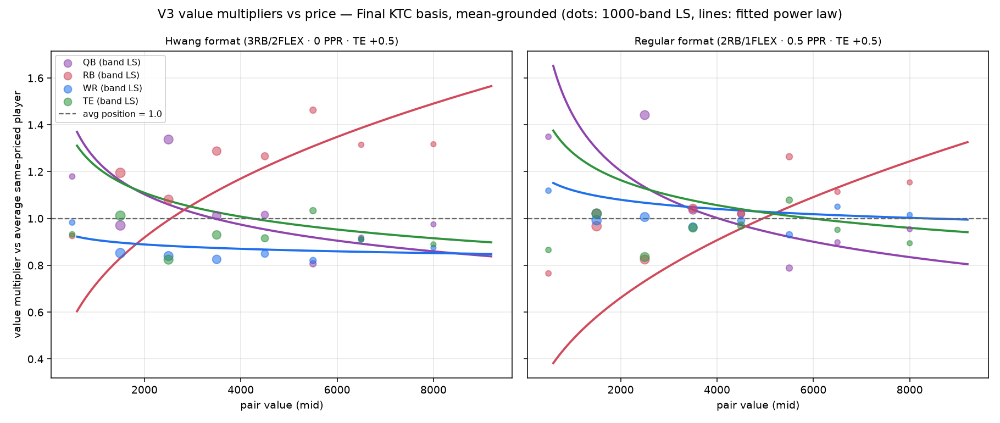
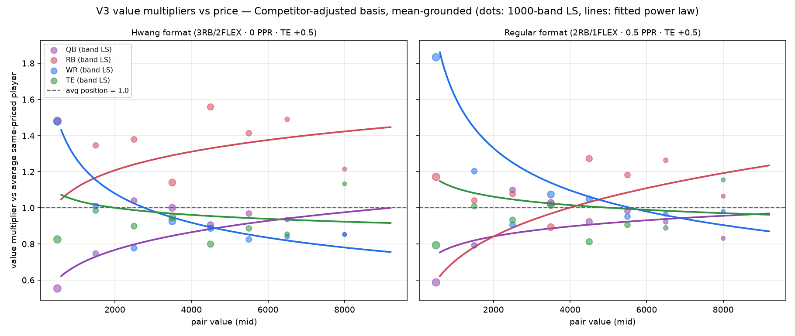
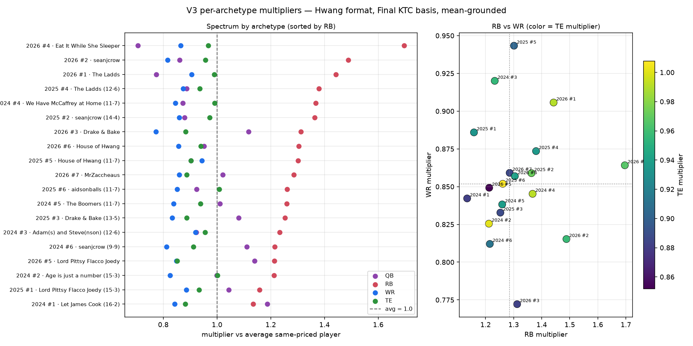
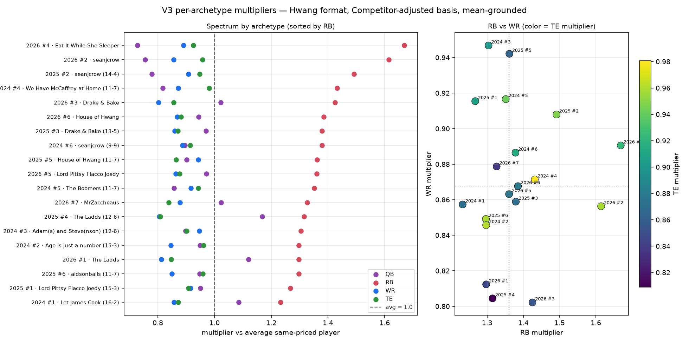
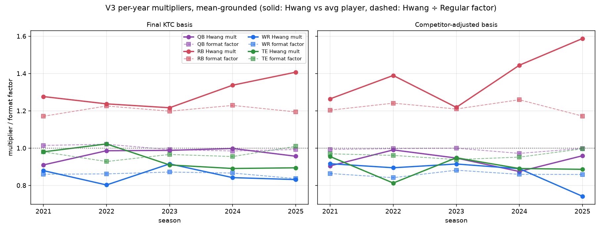

# Hwang True Simulator — V3 Diagnostics Report (weighted + mean-grounded)

Data: `example_data/hwang_true_sim_200_v3/` · reproduce with
`scripts/run_hwang_true_sim_example.mjs` + `scripts/analyze_hwang_true_sim_v3.py`.
Same corrected 19 archetypes, seed, and grid as v2
(200 builds × {KTC, comp} × {Hwang, Regular}).

## What changed in the model (v2 → v3)

1. **Value-weighted pairs** — each pair's contribution is weighted by its mid value
   (v/5000), so the aggregate answers "where the money is" instead of counting a 700-KTC
   dart pair the same as an 8k superstar pair.
2. **Points-weighted builds** — each build's contribution is weighted by its base-roster
   season optimal total (pts/2500): a team scoring 7% more points gets 7% more influence.
3. **Mean grounding (new default)** — instead of pinning QB at exactly 1.0, the geometric
   mean of all four positions is 1.0. Multipliers read "vs the average same-priced player,"
   QB gets its own multiplier, and QB-specific noise no longer leaks into the RB/WR/TE
   shapes. QB grounding remains available (engine option + web UI dropdown, default off).
   Grounding is a pure re-gauging: ratios between any two positions are identical in both.

The web UI runs this model too: pair/build weighting is built into the engine, and the
"Multiplier grounding" selector chooses the gauge.

---

## Writeup 1: Final KTC basis

**Baseline multipliers** (1.0 = average same-priced player):

| | Hwang | Regular | Format factor |
|---|---|---|---|
| QB | 0.969 | 0.969 | 1.000 |
| RB | **1.298** | 1.079 | **1.203** |
| WR | **0.852** | 0.993 | 0.858 |
| TE | 0.933 | 0.962 | 0.969 |

Compared with v2 (QB-gauge RB 1.235 → v3 QB-gauge equivalent 1.34), the value/points
weighting lifted RB — consistent with the tier analysis: RB's edge grows with price, so
weighting toward expensive pairs raises its average. **The format factors are once again
nearly unchanged** (RB 1.20, WR 0.86, TE 0.97, QB 1.00). Across every methodology change so
far — value basis, archetype correction, weighting, grounding — the format factor has stayed
within RB 1.18–1.25, WR 0.86–0.88, TE 0.96–0.99. It is the most robust number this project
has produced. Notably, QB's format factor is 1.00 *without* being pinned — the format
genuinely doesn't change QB's relative value, it just demands more of them.

**By 1000-KTC band** (Hwang / Regular / factor):

| Band | Pairs | QB | RB | WR | TE |
|---|---|---|---|---|---|
| 0k–1k | 220 | 1.18 / 1.35 / 0.87 | 0.93 / 0.77 / **1.21** | 0.98 / 1.12 / 0.88 | 0.93 / 0.87 / 1.08 |
| 1k–2k | 1,479 | 0.97 / 1.02 / 0.95 | 1.20 / 0.97 / **1.24** | 0.85 / 0.99 / 0.86 | 1.01 / 1.02 / 0.99 |
| 2k–3k | 1,297 | 1.34 / 1.44 / 0.93 | 1.08 / 0.82 / **1.31** | 0.84 / 1.01 / 0.83 | 0.82 / 0.84 / 0.99 |
| 3k–4k | 1,096 | 1.01 / 1.04 / 0.98 | 1.29 / 1.04 / **1.23** | 0.83 / 0.96 / 0.86 | 0.93 / 0.96 / 0.97 |
| 4k–5k | 658 | 1.02 / 1.02 / 1.00 | 1.27 / 1.02 / **1.24** | 0.85 / 0.99 / 0.86 | 0.92 / 0.97 / 0.94 |
| 5k–6k | 427 | 0.81 / 0.79 / 1.02 | 1.46 / 1.26 / 1.16 | 0.82 / 0.93 / 0.88 | 1.03 / 1.08 / 0.96 |
| 6k–7k | 181 | 0.92 / 0.90 / 1.02 | 1.31 / 1.11 / 1.18 | 0.91 / 1.05 / 0.87 | 0.91 / 0.95 / 0.96 |
| 7k+ | 131 | 0.98 / 0.95 / 1.02 | 1.32 / 1.15 / 1.14 | 0.88 / 1.02 / 0.86 | 0.89 / 0.89 / 0.99 |

The mean gauge finally explains v2's weird 2k–3k crater (where RB/WR/TE all looked terrible):
it was **QB strength in that band** — 2k–3k KTC buys a locked-in SF starter, and QB hits 1.34
there. RB/WR/TE weren't collapsing; they were being measured against unusually good QBs.

**Fitted power laws** — `m(v) = c · (v/5000)^k`, mean gauge (all four positions get one):

| Position | Hwang equation | @1k | @3k | @5k | @8k |
|---|---|---|---|---|---|
| QB | 0.936 · (v/5000)^−0.180 | 1.25× | 1.03× | 0.94× | 0.86× |
| RB | 1.265 · (v/5000)^+0.349 | 0.72× | 1.06× | 1.27× | 1.49× |
| WR | 0.865 · (v/5000)^−0.031 | 0.91× | 0.88× | 0.86× | 0.85× |
| TE | 0.977 · (v/5000)^−0.139 | 1.22× | 1.05× | 0.98× | 0.92× |

(Regular for reference: QB 0.945·x^−0.263, RB 1.004·x^+0.456, WR 1.028·x^−0.053,
TE 1.025·x^−0.139.)

Reading the shapes:

- **RB is the only position whose value rises with price** (k = +0.35): elite RBs ~1.5×,
  darts ~0.7×.
- **WR is flat** (k = −0.03) — v2's apparent upward WR slope was QB leakage. WRs are just
  uniformly ~0.85–0.88 at every price point: a constant ~14% KTC tax in Hwang.
- **QB slopes down** (k = −0.18): cheap QBs (a startable body at a backup price) are good
  value in superflex; premium QBs are slightly below average per dollar.
- **TE slopes gently down**: cheap TEs beat average, elite TEs pay a small premium.

---

## Writeup 2: Competitor-adjusted basis

**Baseline multipliers:**

| | Hwang | Regular | Format factor |
|---|---|---|---|
| QB | 0.935 | 0.943 | 0.992 |
| RB | **1.369** | 1.123 | **1.218** |
| WR | **0.870** | 1.011 | 0.860 |
| TE | 0.898 | 0.934 | 0.962 |

Same robustness story: format factors match the KTC basis (RB 1.22 vs 1.20, WR 0.86 vs 0.86,
TE 0.96 vs 0.97). RB stays heavily underpriced even as a pure this-season asset.

**By 1000-comp-value band** (Hwang / Regular / factor):

| Band | Pairs | QB | RB | WR | TE |
|---|---|---|---|---|---|
| 0k–1k | 887 | 0.55 / 0.59 / 0.94 | 1.48 / 1.17 / **1.26** | 1.48 / 1.83 / 0.81 | 0.83 / 0.79 / 1.04 |
| 1k–2k | 383 | 0.75 / 0.79 / 0.94 | 1.35 / 1.04 / **1.29** | 1.01 / 1.20 / 0.84 | 0.98 / 1.01 / 0.98 |
| 2k–3k | 431 | 1.04 / 1.10 / 0.95 | 1.38 / 1.08 / **1.28** | 0.78 / 0.91 / 0.86 | 0.90 / 0.93 / 0.96 |
| 3k–4k | 721 | 1.00 / 1.03 / 0.97 | 1.14 / 0.89 / **1.28** | 0.93 / 1.07 / 0.86 | 0.95 / 1.02 / 0.93 |
| 4k–5k | 559 | 0.91 / 0.92 / 0.98 | 1.56 / 1.27 / 1.22 | 0.89 / 1.05 / 0.85 | 0.80 / 0.81 / 0.98 |
| 5k–6k | 395 | 0.97 / 0.98 / 0.99 | 1.41 / 1.18 / 1.20 | 0.82 / 0.95 / 0.87 | 0.89 / 0.91 / 0.98 |
| 6k–7k | 173 | 0.94 / 0.92 / 1.01 | 1.49 / 1.26 / 1.18 | 0.84 / 0.97 / 0.87 | 0.85 / 0.89 / 0.96 |
| 7k+ | 74 | 0.85 / 0.83 / 1.03 | 1.21 / 1.06 / 1.14 | 0.85 / 0.98 / 0.87 | 1.13 / 1.15 / 0.98 |

**Fitted power laws** (mean gauge):

| Position | Hwang equation | @1k | @3k | @5k | @8k |
|---|---|---|---|---|---|
| QB | 0.899 · (v/5000)^+0.174 | 0.68× | 0.82× | 0.90× | 0.98× |
| RB | 1.346 · (v/5000)^+0.118 | 1.11× | 1.27× | 1.35× | 1.42× |
| WR | 0.871 · (v/5000)^−0.234 | 1.27× | 0.98× | 0.87× | 0.78× |
| TE | 0.949 · (v/5000)^−0.058 | 1.04× | 0.98× | 0.95× | 0.92× |

(Regular: QB 0.916·x^+0.092, RB 1.059·x^+0.251, WR 1.031·x^−0.279, TE 1.001·x^−0.065.)

The mean gauge dramatically cleans up v2's wild comp-basis shapes (those huge negative
exponents were the cheap-QB artifact — a near-zero-comp QB really is worthless, and pinning
QB=1 there inflated everything else). The v3 picture is much saner:

- **QB slopes up** (+0.17): cheap comp-value QBs are the worst asset in the pool; premium
  QBs approach fair.
- **RB is high everywhere and nearly flat** (1.11× at 1k to 1.42× at 8k) — the comp index
  underrates RBs across the board, most at the top.
- **WR crosses fair around 3k**: cheap WR lottery tickets out-deliver (best ball harvests
  spike weeks), elite comp-priced WRs underdeliver (~0.78×) — ADP prices them for PPR
  formats.
- **TE hugs 1.0** — the comp index prices TEs fairly at every level.

---

## Archetype spectrum

Mean-grounded, Hwang format, engine-weighted totals. QB now appears explicitly.

- **The QB-room diagonal is gone.** In v2, all three positions marched up-and-right together
  because everything was measured against each archetype's own QBs. Mean-grounding shows
  that effect as the QB dots themselves (0.71 for Eat It While She Sleeper's stacked QB room,
  1.19 for Let James Cook's weak one) and frees the other positions from it.
- **RB spread halved** (1.13–1.70, was 0.87–2.30) — most of the v2 spread was QB-room
  contamination, not construction differences. What remains is real: Eat It While She
  Sleeper (1.70) and seanjcrow 2026 (1.49) are genuinely RB-starved.
- **The unanimous verdict:** all 19 archetypes have RB above 1.0 (lowest 1.13) and all 19
  have WR below 1.0 (highest 0.94). No roster context in the league — however RB-heavy or
  WR-starved — flips the sign. The RB premium and WR tax are structural, not situational.

---

## By-year breakdown (recency check)

**Final KTC basis** (Hwang / Regular / factor):

| Year | QB | RB | WR | TE |
|---|---|---|---|---|
| 2021 | 0.91 / 0.90 / 1.01 | 1.28 / 1.09 / **1.17** | 0.88 / 1.02 / 0.86 | 0.98 / 1.00 / 0.98 |
| 2022 | 0.99 / 0.97 / 1.02 | 1.24 / 1.01 / **1.23** | 0.80 / 0.93 / 0.86 | 1.02 / 1.10 / 0.93 |
| 2023 | 0.99 / 1.00 / 0.99 | 1.22 / 1.02 / **1.20** | 0.92 / 1.05 / 0.87 | 0.91 / 0.94 / 0.97 |
| 2024 | 1.00 / 1.01 / 0.98 | 1.34 / 1.09 / **1.23** | 0.84 / 0.97 / 0.87 | 0.89 / 0.93 / 0.95 |
| 2025 | 0.96 / 0.96 / 0.99 | 1.41 / 1.18 / **1.19** | 0.83 / 0.99 / 0.84 | 0.89 / 0.89 / 1.01 |

**Competitor-adjusted basis:**

| Year | QB | RB | WR | TE |
|---|---|---|---|---|
| 2021 | 0.90 / 0.91 / 0.99 | 1.26 / 1.05 / **1.20** | 0.92 / 1.06 / 0.86 | 0.95 / 0.98 / 0.97 |
| 2022 | 0.99 / 0.99 / 1.00 | 1.39 / 1.12 / **1.24** | 0.89 / 1.06 / 0.84 | 0.81 / 0.85 / 0.96 |
| 2023 | 0.95 / 0.95 / 1.00 | 1.22 / 1.01 / **1.21** | 0.91 / 1.04 / 0.88 | 0.95 / 1.01 / 0.94 |
| 2024 | 0.87 / 0.90 / 0.97 | 1.44 / 1.15 / **1.26** | 0.89 / 1.04 / 0.86 | 0.89 / 0.94 / 0.95 |
| 2025 | 0.96 / 0.96 / 1.00 | 1.59 / 1.35 / **1.17** | 0.74 / 0.86 / 0.86 | 0.89 / 0.89 / 1.00 |

Same conclusion as v2, now cleaner: **format factors are flat across all five seasons**
(RB 1.17–1.23, WR 0.84–0.87, TE 0.93–1.01, QB ~1.00) — no recency skew warranted. The raw
RB multiplier has trended up since 2022 on both bases (KTC: 1.22 → 1.41), so recent seasons
strengthen rather than weaken the RB case.

---

## Bottom line (v3 numbers)

Mean-grounded, value- and points-weighted, KTC basis, Hwang format:

- **QB 0.97 · RB 1.30 · WR 0.85 · TE 0.93** as flat coefficients, or better:
- **QB** `0.936·(v/5000)^−0.18` · **RB** `1.265·(v/5000)^+0.35` ·
  **WR** `0.865·(v/5000)^−0.03` · **TE** `0.977·(v/5000)^−0.14`
- WR's flatness makes a single 0.85 coefficient safe; RB genuinely needs its curve.
- The format factor (RB ~1.20, WR ~0.86, TE ~0.97, QB ~1.00) has now survived five
  methodology changes unchanged — treat it as settled.
