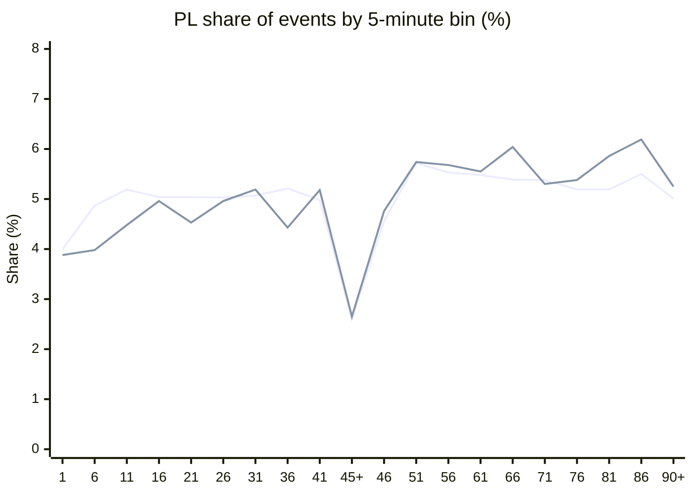

# Corners and goals peak in the same 5-minute pockets

Premier League 2008–2016. **33,252 corners** (3,039 matches) and **8,240 goals** (2,789 matches) from the European Soccer Database event dump.

**Punchline:** the timing *shapes* match (Pearson **r = 0.85**). Shared hot windows are a clock effect, not corners clustering around goals. Inside a given match, a 5-minute window with a corner is slightly *less* likely to also contain a goal than chance (lift **0.97**).

| | |
|---|---|
| PL Pearson r, bin shares | **0.85** |
| Hottest regular 5-min pocket | **51–55** |
| Coldest regular 5-min pocket | **1–5** |
| Within-match corner × goal lift | **0.97×** |
| First half | corners 44.4% · goals 41.6% |
| Second half | corners 47.9% · goals 50.5% |

---

## Heatmap (share of events)

Cell is **relative rate**: bin’s share of all corners/goals ÷ 5%. Flat would be `1.00`. **Both** is the geometric mean of the two rates — pockets where they rise together.

Stoppage bins (`45+`, `90+`) are dashed in spirit: they are not a full 5 minutes of clock (typical tagged added time in this sample: HT **2.1 min**, FT **3.2 min**), so they look cold on a share scale and hot on a per-minute scale.

```
minute   1    6   11   16   21   26   31   36   41  45+   46   51   56   61   66   71   76   81   86  90+
corners 0.80 0.97 1.04 1.01 1.01 1.01 1.01 1.04 1.00 0.52 0.91 1.14 1.11 1.10 1.08 1.08 1.04 1.04 1.10 1.00
goals   0.78 0.80 0.90 0.99 0.91 0.99 1.04 0.89 1.04 0.53 0.95 1.15 1.14 1.11 1.21 1.06 1.08 1.17 1.24 1.05
both    0.79 0.88 0.97 1.00 0.96 1.00 1.02 0.96 1.02 0.52 0.93 1.14 1.12 1.10 1.14 1.07 1.06 1.10 1.17 1.02
```

Same thing as a heat strip (`░` cold · `▒` average · `▓` hot · `█` very hot):

```
corners  ░▒▒▒▒▒▒▒▒░▒▓▓▓▓▓▒▒▓▒
goals    ░░▒▒▒▒▒▒▒░▒▓▓█▓▒▓██▒
both     ░▒▒▒▒▒▒▒▒░▒▓▓▓▓▓▒▓█▒
         1        45+      51              86 90+
```



---

## Dual-hot pockets

Bins where **both** corner and goal relative share ≥ 1.05, ranked by joint intensity.

| Bin | Joint | Corners | Goals | Corners / match | Goals / match |
|---|---:|---:|---:|---:|---:|
| **86–90** | 1.17 | 1.10× (5.50%) | 1.24× (6.19%) | 0.60 | 0.18 |
| **51–55** | 1.14 | 1.14× (5.72%) | 1.15× (5.74%) | 0.63 | 0.17 |
| **66–70** | 1.14 | 1.08× (5.39%) | 1.21× (6.04%) | 0.59 | 0.18 |
| **56–60** | 1.12 | 1.11× (5.53%) | 1.14× (5.68%) | 0.61 | 0.17 |
| **61–65** | 1.10 | 1.10× (5.48%) | 1.11× (5.55%) | 0.60 | 0.16 |
| **81–85** | 1.10 | 1.04× (5.19%) | 1.17× (5.86%) | 0.57 | 0.17 |
| **71–75** | 1.07 | 1.08× (5.38%) | 1.06× (5.30%) | 0.59 | 0.16 |
| **76–80** | 1.06 | 1.04× (5.19%) | 1.08× (5.38%) | 0.57 | 0.16 |

**51–70** is the sustained dual-hot block. **81–90** is the late dual-hot block, hotter for goals than corners.

---

## Dual-cold pockets

| Bin | Joint | Corners | Goals |
|---|---:|---:|---:|
| **45+** (share scale) | 0.52 | 0.52× | 0.53× |
| **1–5** | 0.79 | 0.80× | 0.78× |
| **6–10** | 0.88 | 0.97× | 0.80× |
| **46–50** | 0.93 | 0.91× | 0.95× |

Kickoff and the half-time restart are dead for both. `45+` only looks dead because it is ~2 minutes of clock, not 5 — see per-minute below.

---

## Per minute of clock (stoppage ranking flips)

Relative to the regular-time mean rate. Stoppage duration from tagged `elapsed_plus` in this sample (HT 2.1 min, FT 3.2 min).

| Bin | Corners / min | Goals / min |
|---|---:|---:|
| **90+** | **1.51×** | **1.59×** |
| **45+** | **1.24×** | **1.26×** |
| 86–90 | 1.07× | 1.21× |
| 51–55 | 1.11× | 1.12× |
| 66–70 | 1.05× | 1.18× |
| 1–5 | 0.78× | 0.76× |
| 46–50 | 0.89× | 0.93× |

Tagged stoppage is the most intense stretch of the match for both events. A live added-time input matters more than the 5-minute shape.

---

## Same window of the same match: no cluster

2,788 PL matches present in both files, 55,760 match-bins:

| | |
|---|---|
| P(corner in bin) | 0.41 |
| P(goal in bin) | 0.14 |
| P(both) | 0.057 |
| Independence | 0.058 |
| Lift | **0.97** |
| Pearson (n corners vs n goals in a match-bin) | **−0.02** |
| Mean corners in the same 5-min bin as a goal | 0.52 vs 0.55 unconditional |

Shared pockets are *when you are in the match*, not “a goal just happened so a corner is next.”

---

## What this means for the next-5/10-minute corner model

1. **Using the goal-timing curve as a corner-timing curve is a good approximation** in the Premier League (r = 0.85). The error is systematic: corners are +2.8 pp more first-half than goals, and goals pile up more from 81–90. A goal-based concentration slightly **underweights early windows** and **overweights the last ten minutes** of regular time.

2. **Do not split 15-minute buckets into even thirds.** 1–5 and 46–50 are dead zones. The 0–15 and 46–60 goal buckets overstate those reopenings.

3. **Stoppage is the real intensity spike** once you account for duration. Historical 2008–2016 added time is shorter than the post-2023 regime, so this sample will **understate** 90+ share relative to today’s market.

4. **Do not treat the heatmap as evidence of clustering.** The original “corners are clustered, so a no-clustering Poisson is conservative for 3+/4+ overs” still has to come from within-match overdispersion, not from this clock correlation.

---

## Full PL table

| Bin | Corner share | Goal share | Corner rel | Goal rel | Joint | Corners/match | Goals/match |
|---|---:|---:|---:|---:|---:|---:|---:|
| 1–5 | 4.00% | 3.88% | 0.80 | 0.78 | 0.79 | 0.44 | 0.11 |
| 6–10 | 4.87% | 3.98% | 0.97 | 0.80 | 0.88 | 0.53 | 0.12 |
| 11–15 | 5.19% | 4.48% | 1.04 | 0.90 | 0.97 | 0.57 | 0.13 |
| 16–20 | 5.04% | 4.96% | 1.01 | 0.99 | 1.00 | 0.55 | 0.15 |
| 21–25 | 5.04% | 4.53% | 1.01 | 0.91 | 0.96 | 0.55 | 0.13 |
| 26–30 | 5.03% | 4.96% | 1.01 | 0.99 | 1.00 | 0.55 | 0.15 |
| 31–35 | 5.07% | 5.19% | 1.01 | 1.04 | 1.02 | 0.56 | 0.15 |
| 36–40 | 5.21% | 4.43% | 1.04 | 0.89 | 0.96 | 0.57 | 0.13 |
| 41–45 | 4.98% | 5.18% | 1.00 | 1.04 | 1.02 | 0.54 | 0.15 |
| 45+ | 2.61% | 2.65% | 0.52 | 0.53 | 0.52 | 0.29 | 0.08 |
| 46–50 | 4.56% | 4.76% | 0.91 | 0.95 | 0.93 | 0.50 | 0.14 |
| 51–55 | 5.72% | 5.74% | 1.14 | 1.15 | 1.14 | 0.63 | 0.17 |
| 56–60 | 5.53% | 5.68% | 1.11 | 1.14 | 1.12 | 0.61 | 0.17 |
| 61–65 | 5.48% | 5.55% | 1.10 | 1.11 | 1.10 | 0.60 | 0.16 |
| 66–70 | 5.39% | 6.04% | 1.08 | 1.21 | 1.14 | 0.59 | 0.18 |
| 71–75 | 5.38% | 5.30% | 1.08 | 1.06 | 1.07 | 0.59 | 0.16 |
| 76–80 | 5.19% | 5.38% | 1.04 | 1.08 | 1.06 | 0.57 | 0.16 |
| 81–85 | 5.19% | 5.86% | 1.04 | 1.17 | 1.10 | 0.57 | 0.17 |
| 86–90 | 5.50% | 6.19% | 1.10 | 1.24 | 1.17 | 0.60 | 0.18 |
| 90+ | 5.01% | 5.25% | 1.00 | 1.05 | 1.02 | 0.55 | 0.16 |

---

## All-leagues caveat

Same pattern in England, Spain, Italy, Germany: second-half 51–70 and late 81–90 dual-hot; 1–5 and 46–50 dual-cold. **Do not trust all-leagues 86–90.** Outside the PL, 86–90 takes 7.93% of goals vs 5.40% of corners because untagged stoppage is collapsed into `elapsed = 90` with blank `elapsed_plus`. PL tagging is cleaner (86–90 goals 6.19%, 90+ 5.25%).

---

## Method

- Events binned on **elapsed** clock minutes. `elapsed = 45` or `90` with `elapsed_plus > 0` → `45+` / `90+`. Untagged 45/90 events stay in `41–45` / `86–90`.
- Own goals credited to the opponent (verified: `team` is always the scorer’s side).
- Deleted events (`del = 1`) and non-goals (`dg`, `npm`, `psm`, `rp`) dropped.
- Source files: `corner_timing.csv`, `goal_timing.csv` in this folder.
