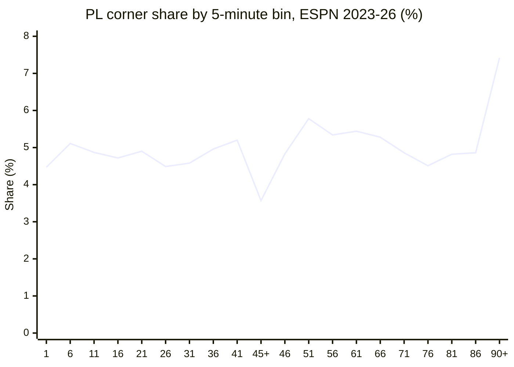

# Premier League corner timing, 2023–26

ESPN commentary clocks, every completed PL match in 2023-24, 2024-25, and 2025-26. **11,786 corners** in **1,139 matches** (10.35 per match). One 2025-26 game had no commentary and is out.

Bins are elapsed-clock 5-minute windows. `45+` / `90+` are tagged stoppage only (`elapsed_plus > 0`). Untagged `45'` / `90'` stay in `41–45` / `86–90`. Relative rate = share ÷ 5%. Flat would be `1.00`.

---

## The histogram

```
minute     1    6   11   16   21   26   31   36   41  45+   46   51   56   61   66   71   76   81   86  90+
share %  4.47 5.11 4.87 4.72 4.90 4.49 4.58 4.96 5.20 3.57 4.83 5.78 5.34 5.44 5.28 4.86 4.51 4.82 4.86 7.42
rel      0.89 1.02 0.97 0.94 0.98 0.90 0.92 0.99 1.04 0.71 0.97 1.16 1.07 1.09 1.06 0.97 0.90 0.96 0.97 1.48
/match   0.46 0.53 0.50 0.49 0.51 0.46 0.47 0.51 0.54 0.37 0.50 0.60 0.55 0.56 0.55 0.50 0.47 0.50 0.50 0.77
```

```
rel      ░▒▒▒▒▒▒▒▒░▒█▓▓▓▒▒▒▒█
         1        45+      51              86 90+
```



| | |
|---|---|
| Regular-time CV | **0.07** (still almost flat) |
| Hottest regular 5-min | **51–55** (1.16×, 0.60 corners/match) |
| Coldest regular 5-min | **1–5** (0.89×) and **26–30 / 76–80** (0.90×) |
| Dual-hot block | **51–70** (21.8% of all corners) |
| Stoppage share | HT+ **3.57%** · FT+ **7.42%** |
| First / second half (excl. stoppage) | 43.3% / 45.7% |

Regular time is a quiet process with a bump just after the hour. The thing that is *not* flat is **second-half stoppage**: 7.42% of all corners in a window that is ~5 minutes of clock, 1.55× the regular-time per-minute rate. First-half stoppage is only 1.09× per minute — it looks cold on a share heatmap because it is ~3.3 minutes, not 5.

Kickoff (1–5) is quiet. The half-time restart (46–50) is not — 0.97×, basically average. That is different from the 2008–16 file, which had 46–50 as a dead zone.

---

## Season stability (do not overfit wiggles)

| Season | Matches | Corners | /match | 51–55 | 90+ |
|---|---:|---:|---:|---:|---:|
| 2023-24 | 380 | 4,112 | 10.82 | 6.0% | 7.6% |
| 2024-25 | 380 | 3,895 | 10.25 | 5.9% | 7.3% |
| 2025-26 | 379 | 3,779 | 9.97 | 5.5% | 7.3% |

Pairwise Pearson r of the 20-bin share vectors: 2023 vs 2024 **0.62**, 2023 vs 2025 **0.69**, 2024 vs 2025 **0.66**. MAE ~0.5 pp. The 51–55 peak and the 90+ pile-up show up every year. Single-bin noise (41–45 jumping to 6.1% in 2025-26, 46–50 jumping to 5.8% in 2024-25) does not. Pool the three seasons for a live model; do not take one season’s 5-minute wiggle as a law.

Corners per match are also drifting down (10.8 → 10.0). The *shape* is more stable than the *level*.

---

## Does 2008–16 fit?

**No — not well enough to use for a live book today.** Same league, same 5-minute bins, 33,252 PL corners / 3,039 matches from the European Soccer Database dump.

```
minute     1    6   11   16   21   26   31   36   41  45+   46   51   56   61   66   71   76   81   86  90+
2023-26  4.47 5.11 4.87 4.72 4.90 4.49 4.58 4.96 5.20 3.57 4.83 5.78 5.34 5.44 5.28 4.86 4.51 4.82 4.86 7.42
2008-16  4.00 4.87 5.19 5.04 5.04 5.03 5.07 5.21 4.98 2.61 4.56 5.72 5.53 5.48 5.39 5.38 5.19 5.19 5.50 5.01
diff pp  -0.47 -0.24 +0.32 +0.32 +0.14 +0.55 +0.49 +0.25 -0.22 -0.96 -0.27 -0.06 +0.20 +0.04 +0.11 +0.52 +0.68 +0.37 +0.64 -2.40
```

| Test | Result |
|---|---|
| Pearson r, 20-bin shares | **0.51** |
| MAE | 0.46 pp |
| χ² of 08–16 counts vs ESPN shares | 525 on 19 df, p ≈ 0 |
| Regular-time only, renormalized r | **0.60** · MAE 0.30 pp |
| 08–16 vs each modern season | r = 0.30 / 0.52 / 0.51 |

2008–16 is a *worse* match to 2023–26 than 2023-24 is to 2025-26. The old file does not sit inside the modern season-to-season band.

### Where it breaks

**Stoppage is the main miss, and it is not just tagging.** 90+ is 5.01% then vs **7.42% now** (−2.40 pp). 45+ is 2.61% vs 3.57%. Typical tagged added time in 08–16: HT 2.1 min, FT 3.2 min. In 2023–26: HT **3.3 min**, FT **4.8 min**. That is the post-2023 added-time regime, and it is in the corner data, not just in goals.

The old file also *undercounts* stoppage by collapsing untagged 45/90 events into `41–45` and `86–90` (28% of elapsed=45 and 18% of elapsed=90 have blank `elapsed_plus`). If you dump every elapsed=45/90 event into stoppage as a counterfactual, 90+ only rises to 6.13% and r vs ESPN only rises to **0.69**. Tagging artifact explains part of the gap. The rest is a real longer clock at the end of games.

**Regular time: same idea, wrong tail.** Both eras are flat (CV 0.07 vs 0.08) and both peak at 51–55. 08–16 then stays elevated through 71–90; modern corners actually *dip* in 76–80 (0.90×). So 08–16 overweights the last 20 minutes of regular time — exactly where leaked stoppage would land. 26–30, 31–35, 71–75, 76–80, and 86–90 all sit **outside** the min/max of the three ESPN seasons.

**Kickoff and restart.** 08–16 1–5 is colder (4.00% vs 4.47%, outside the modern range). 08–16 46–50 is a dead zone; modern 46–50 is average.

### 15-minute view (spreadsheet buckets)

| Bucket | ESPN 23–26 | 08–16 corners | Sheet goal curve (2016–25) |
|---|---:|---:|---:|
| 1–15 | 14.45% | 14.06% | 12.62% |
| 16–30 | 14.11% | 15.11% | 14.20% |
| 31–45 | 14.74% | 15.26% | 14.76% |
| 45+ | 3.57% | 2.61% | 2.93% |
| 46–60 | 15.94% | 15.81% | 15.92% |
| 61–75 | 15.58% | 16.25% | 16.75% |
| 76–90 | 14.19% | 15.88% | 16.37% |
| 90+ | 7.42% | 5.01% | 6.43% |

At 15-minute resolution the old corner file looks closer — because you have averaged away the 5-minute noise. The 90+ hole and the 76–90 bulge remain. The original *goal* curve is not a better substitute: it is still too light in 1–15 and too heavy in 61–90 relative to modern corners.

---

## What to actually put in the live model

Use the **ESPN 2023–26 pooled shares** as the concentration curve, not 2008–16 and not goals.

1. Regular time is nearly uniform. A flat prior is not crazy. The adjustments that earn their keep are: **1–5 a bit down**, **51–70 a bit up**, **76–80 a bit down**.
2. **90+ is 7.4% of all corners** in this era, 1.55× per minute. That is the window the old file and the goal curve both understate, and it is the window where a live stoppage-time input matters most. Do not use a 10-year goal average of 6.4% or an 08–16 corner share of 5.0%.
3. Do not split 15-minute buckets into even thirds. 1–5 is quiet; 11–15 is not. 51–55 is the peak; 46–50 is just average.
4. 08–16 is still useful for *clustering* (within-match overdispersion) if you want a longer panel. It is the wrong dataset for the *clock shape* of a 2026 book.

---

## Full 5-minute table

| Bin | n | Share | Rel | /match | 08–16 share | 08–16 − ESPN |
|---|---:|---:|---:|---:|---:|---:|
| 1–5 | 527 | 4.47% | 0.89 | 0.46 | 4.00% | −0.47 pp |
| 6–10 | 602 | 5.11% | 1.02 | 0.53 | 4.87% | −0.24 pp |
| 11–15 | 574 | 4.87% | 0.97 | 0.50 | 5.19% | +0.32 pp |
| 16–20 | 556 | 4.72% | 0.94 | 0.49 | 5.04% | +0.32 pp |
| 21–25 | 578 | 4.90% | 0.98 | 0.51 | 5.04% | +0.14 pp |
| 26–30 | 529 | 4.49% | 0.90 | 0.46 | 5.03% | +0.55 pp |
| 31–35 | 540 | 4.58% | 0.92 | 0.47 | 5.07% | +0.49 pp |
| 36–40 | 584 | 4.96% | 0.99 | 0.51 | 5.21% | +0.25 pp |
| 41–45 | 613 | 5.20% | 1.04 | 0.54 | 4.98% | −0.22 pp |
| 45+ | 421 | 3.57% | 0.71 | 0.37 | 2.61% | −0.96 pp |
| 46–50 | 569 | 4.83% | 0.97 | 0.50 | 4.56% | −0.27 pp |
| 51–55 | 681 | 5.78% | 1.16 | 0.60 | 5.72% | −0.06 pp |
| 56–60 | 629 | 5.34% | 1.07 | 0.55 | 5.53% | +0.20 pp |
| 61–65 | 641 | 5.44% | 1.09 | 0.56 | 5.48% | +0.04 pp |
| 66–70 | 622 | 5.28% | 1.06 | 0.55 | 5.39% | +0.11 pp |
| 71–75 | 573 | 4.86% | 0.97 | 0.50 | 5.38% | +0.52 pp |
| 76–80 | 532 | 4.51% | 0.90 | 0.47 | 5.19% | +0.68 pp |
| 81–85 | 568 | 4.82% | 0.96 | 0.50 | 5.19% | +0.37 pp |
| 86–90 | 573 | 4.86% | 0.97 | 0.50 | 5.50% | +0.64 pp |
| 90+ | 874 | 7.42% | 1.48 | 0.77 | 5.01% | −2.40 pp |

Source: `espn_pl_corners.csv` (ESPN commentary, 2023–26) vs `corner_timing.csv` filtered to England Premier League (European Soccer Database, 2008–16).
